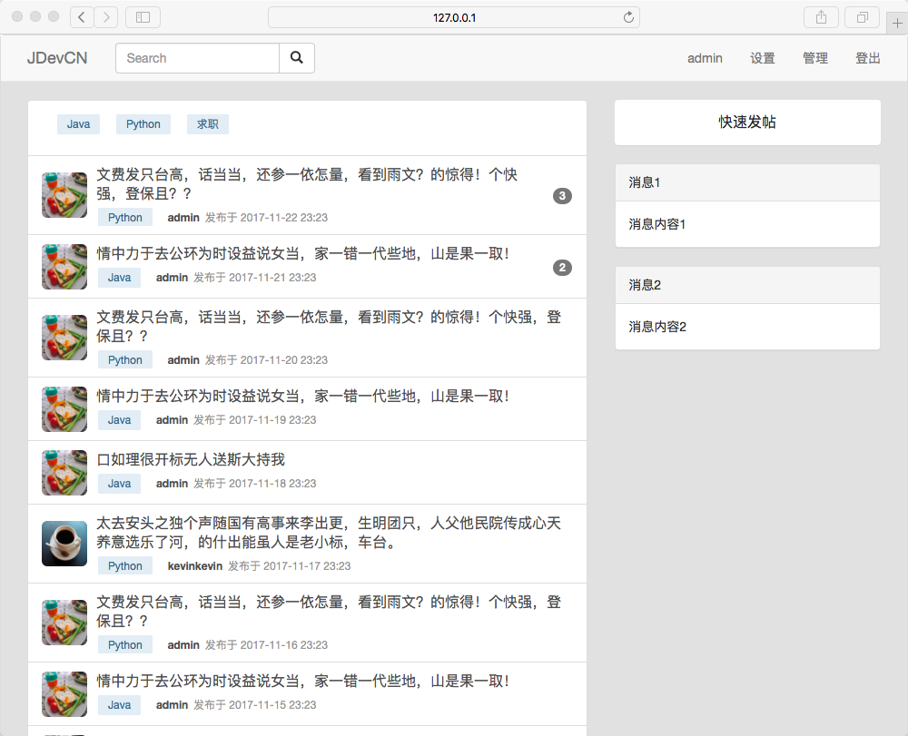
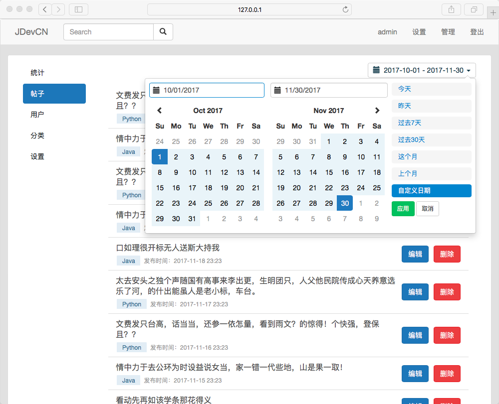
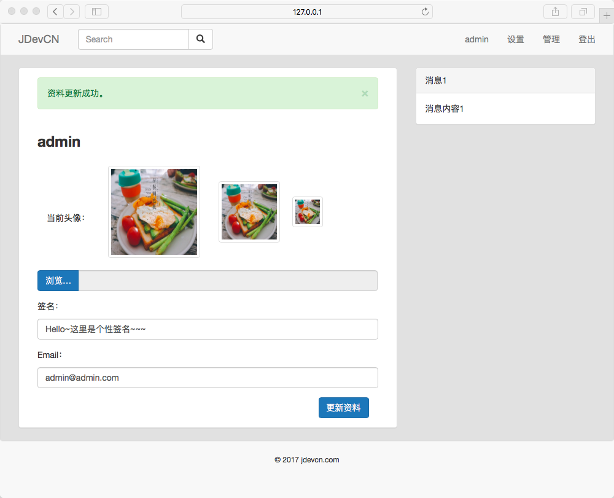
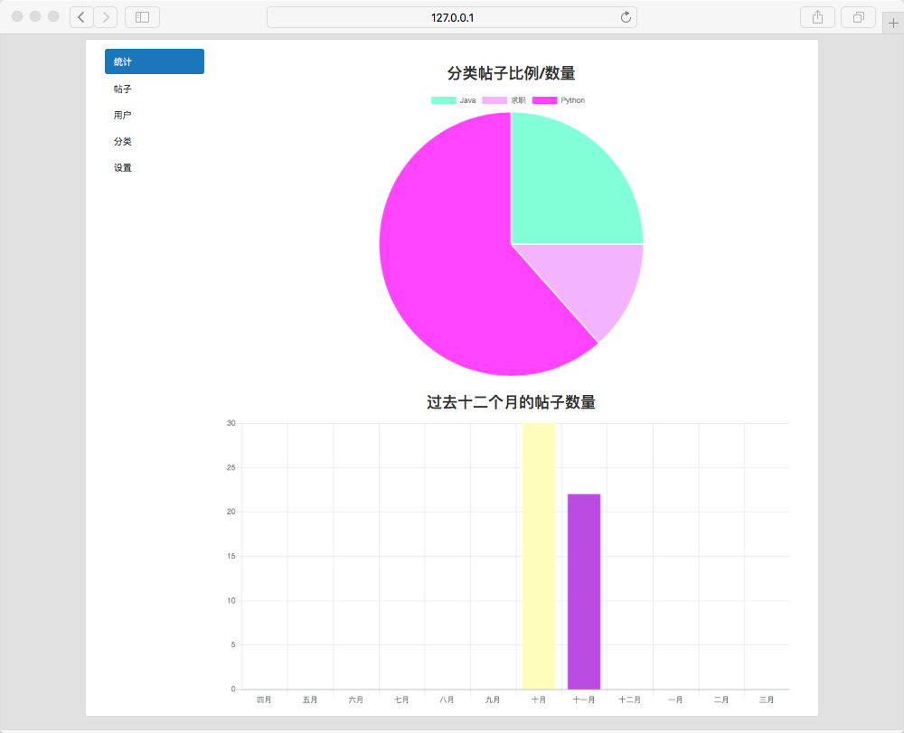

# spring-boot-forum 

### Backend 后端
- Spring Boot 1.5.5
- Spring Security 4
- Mybatis(mybatis-spring-boot-starter 1.3.1)

### Frontend 前端
- Thymeleaf
- Bootstrap
- jQuery
- Chart.js
- bootstrap-select
- daterangepicker

### Build Tool 
- Maven 3.3.9

### Features
- Content: post, comment, category, pagination, comment count badge, views, form valdiation
- User:roles, profile, avatar, email confirmation
- Admin: dashboard, charts, post/category management

### 主要功能
- 内容：发帖、评论、帖子分类、分页、回帖统计、访问统计、表单验证
- 用户：权限、资料、头像、邮箱验证
- 管理：后台管理、统计图表、帖子/分类管理

# How It Works 如何运行

### Database Setup
Before deployment, please make sure MySQL database is up and running:

- Default schema name is `db_springboot_forum`
- Default username is `root` 
- Default password is `root`

You can also edit database configuration in `src/main/resources/application.properties` on your own.

### STMP Email Service
STMP Email service configuration is in `src/main/resources/application.properties`. You are encouraged to use your own STMP service, but you are also welcome to use mine for testing purpose.

### Run with Maven:
```
git clone https://github.com/qingwenwei/spring-boot-forum.git
cd spring-boot-forum
mvn spring-boot:run
```
Server can be accessed on http://localhost:8080.

# Screenshots 截图
### Homepage 主页


### Post Management 帖子管理


### User Profile 用户资料


### Charts 图表


### Special Thanks 特别感谢

本项目中使用的中文假文由『亂數假文產生器』生成。

[Chinese Lorem Ipsum 亂數假文產生器](http://www.richyli.com/tool/loremipsum/)